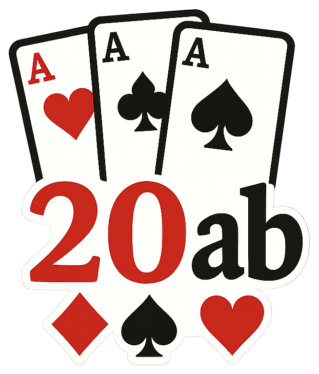

<p align="center">
  
</p>

<h1 align="center">20ab</h1>

<p align="center">
  Game tracker and statistics platform for the German card game <strong>20 ab</strong> by <a href="https://github.com/TheItCrOw">TheItCrow</a>.
</p>

---

## About

20ab is a trick-taking card game where 2--10 players start at 20 points and race to reach zero. Each round, a trump suit is chosen and five tricks are played. Winning tricks lowers your score; failing to win any adds a penalty. Special rules apply depending on the trump suit, and players can choose to sit out rounds at a small cost.

This repository contains two applications that work together:

- **Dashboard** -- a web-based analytics platform for viewing game history and player statistics.
- **Mobile App** -- a companion app used during live games to track scores, enforce rules, and record results.

Games recorded in the mobile app can be exported as JSON and loaded into the dashboard for long-term analysis.

---

## Dashboard

A multi-page analytics dashboard for exploring game history, player performance, and trends.

**Tech stack:** Python, Plotly Dash, Dash Mantine Components, Dash Bootstrap Components, Pandas, Pydantic, Waitress (WSGI).

**Features:**

- Total wins, losses, and win/loss percentages per player
- Average points per round, dropout rates, and balance-loss metrics
- Filterable by player and date range
- Leaderboard and per-game breakdowns
- Pydantic-validated data models loaded from JSON files

See [`dashboard/`](dashboard/) for details.

---

## Mobile App

A React Native app for live score tracking during 20ab sessions. Handles all game rules, turn order, and end-of-game detection so players can focus on the cards.

**Tech stack:** React Native 0.81, Expo SDK 54, TypeScript, Expo Router, AsyncStorage.

**Features:**

- Full game flow: player selection, seating order, trump selection, score entry
- Automatic rule enforcement (sit-out eligibility, trick limits, hearts doubling, clubs forcing play)
- Draw detection with tiebreaker rounds
- Game history log with per-round deltas and trump indicators
- JSON export for dashboard integration
- Works on Android and iOS

See [`mobile-app/`](mobile-app/) for details.

---

## Project Structure

```
20ab/
  dashboard/       Python Dash analytics dashboard
  mobile-app/      React Native Expo companion app
  data/            Game history and player data (JSON)
  pyproject.toml   Python project configuration
```

---

## Data

Game data lives in `data/games/` as individual JSON files. Each file records the date, all rounds with per-player moves, and the final result (finisher, loser, winners). Player definitions are stored in `data/players.json`.

The mobile app writes to local device storage during play and can export finished games in the same JSON format the dashboard consumes.
